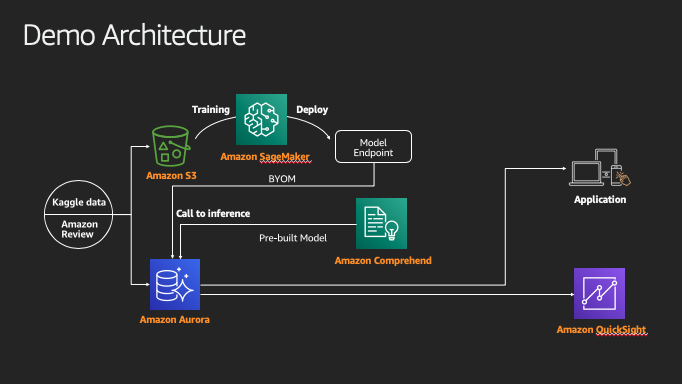

# 아직도 파이썬으로만 머신 러닝 하니? 난 SQL로 바로 쓴다!

## Seoul Summit 2020 Demo Tutorial

안녕하세요. [아직도 파이썬으로만 머신 러닝 하니? 난 SQL로 바로 쓴다.] 세션을 발표한 송규호 & 정의준입니다.
이곳은 세션에서 발표한 데모를 만들기 위한 전반적인 과정을 담은 튜토리얼 페이지입니다.

## Architecture

---

© 2020 Amazon Web Services, Inc. 또는 자회사, All rights reserved.

