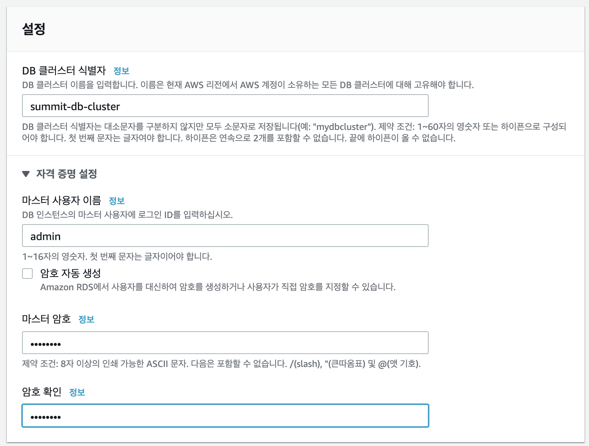

이번 단계에서는 Aurora Database를 생성하고 데이터를 실습 전체에서 사용할 데이터를 입력합니다.
 
## Table of Contents

1. Aurora DB
2. EC2 Instance 생성
3. 실습 데이터 다운로드 (Kaggle E-commerce dataset)
4. MySQL 셋업 및 테이블 생성


## Aurora DB

1. Amazon RDS 페이지로 이동합니다. [link](https://ap-northeast-2.console.aws.amazon.com/rds/home?region=ap-northeast-2)

2. `데이터베이스 생성`을 클릭합니다.

3. 아래 내용을 참고하여 Aurora 클러스터를 생성합니다.

```
데이터베이스 생성 방식 선택 : 표준 생성
엔진 옵션 : Amazon Aurora
에디션 : MySQL과 호환되는 Amazon Aurora
버전 : Aurora (MySQL 5.7) 2.07.0 이상
```

4. `DB 클러스터 식별자`에는 `summit-db-cluster`를 입력합니다.
`마스터 사용자 이름`에는 MySQL에서 사용할 마스터 사용자 이름을 입력합니다.
마스터 사용자의 암호를 입력하고 데이터 베이스 생성을 클릭합니다.



5. Amazon Aurora 클러스터가 생성되면 엔드포인트를 따로 적어둡니다.


## EC2 instance 생성


여기서 생성할 EC2 인스턴스는 RDS에 접속할 클라이언트 용도입니다.

1. 아래의 지시를 따라서 인스턴스를 생성합니다.
* https://aws.amazon.com/ko/premiumsupport/knowledge-center/create-linux-instance/

2. 앞서 생성한 Amazon Aurora와 동일한 Security Group을 지정합니다.

3. Security Group의 inbound rule에 3306 포트를 추가합니다.


## 실습 데이터 다운로드

1. 실습에서 사용할 데이터를 다운로드합니다. 이 데이터는 Kaggle에서 찾을 수 있으며 유저의 구매 이력 데이터로서 DB용 데이터를 만드는데 사용되었으며, 추후 SageMaker 실습에서 사용할 예정입니다.
	
	> 데이터에 대한 자세한 사항은 출처 [eCommerce behavior data from multi category store](https://www.kaggle.com/mkechinov/ecommerce-behavior-data-from-multi-category-store)에서 확인해 주십시오.

2. 데이터를 실습용 S3 bucket에 업로드합니다. `USERID` 부분에는 본인의 ID를 작성합니다.

```
aws s3 mb s3://summit-demo-USERID --region ap-northeast-2
aws s3 cp 2019-Oct.csv s3://summit-demo-USERID/
aws s3 cp 2019-Nov.csv s3://summit-demo-USERID/
```

## MySQL 셋업 및 테이블 생성


1. 실습에서 사용할 DB용 데이터를 다운로드합니다.

```
wget https://raw.githubusercontent.com/elbanic/summit_2020_demo/master/sample-data/users/users.csv
wget https://raw.githubusercontent.com/elbanic/summit_2020_demo/master/sample-data/products/products.csv
```

2. EC2 Instance에서 MySQL Client를 이용하여 Aurora MySQL 접속합니다.
MySQL Client 프로그램이 없으면 `yum install -y mysql` 명령어를 이용하여 설치합니다.

```
mysql -h summit-db-cluster-instance-1.csz1mbf6avao.ap-northeast-2.rds.amazonaws.com -P 3306 -u admin -p
Enter password:
```

3. Database와 User를 생성합니다

```
CREATE DATABASE ecommerce;

CREATE USER 'user1'@'%' IDENTIFIED BY 'password1';

GRANT SELECT, INSERT, UPDATE, DELETE, CREATE, DROP, RELOAD, PROCESS, REFERENCES, INDEX, ALTER, SHOW DATABASES, CREATE TEMPORARY TABLES, LOCK TABLES, EXECUTE, REPLICATION SLAVE, REPLICATION CLIENT, CREATE VIEW, SHOW VIEW, CREATE ROUTINE, ALTER ROUTINE, CREATE USER, EVENT, TRIGGER ON *.* TO 'user1'@'%' WITH GRANT OPTION;
```


4. Table을 생성하고 데이터를 Table에 입력합니다.

```
USE ecommerce;

CREATE TABLE products (
    product_id BIGINT PRIMARY KEY,
    category_id VARCHAR(30),
    category_code VARCHAR(30),
    brand VARCHAR(30),
    price FLOAT,
    product_name VARCHAR(30)
);

LOAD DATA LOCAL INFILE '/home/ec2-user/products.csv' INTO TABLE products
FIELDS TERMINATED BY ','
OPTIONALLY ENCLOSED BY '"'
IGNORE 1 LINES;
```

```
CREATE TABLE users (
    user_id BIGINT PRIMARY KEY,
    sum_purchase FLOAT
);

LOAD DATA LOCAL INFILE '/home/ec2-user/users.csv' INTO TABLE users
FIELDS TERMINATED BY ','
OPTIONALLY ENCLOSED BY '"'
IGNORE 1 LINES;
```

5. 실습에서 사용할 데이터가 모두 준비되었습니다.


---
<p align="center">
© 2020 Amazon Web Services, Inc. 또는 자회사, All rights reserved.
</p>
