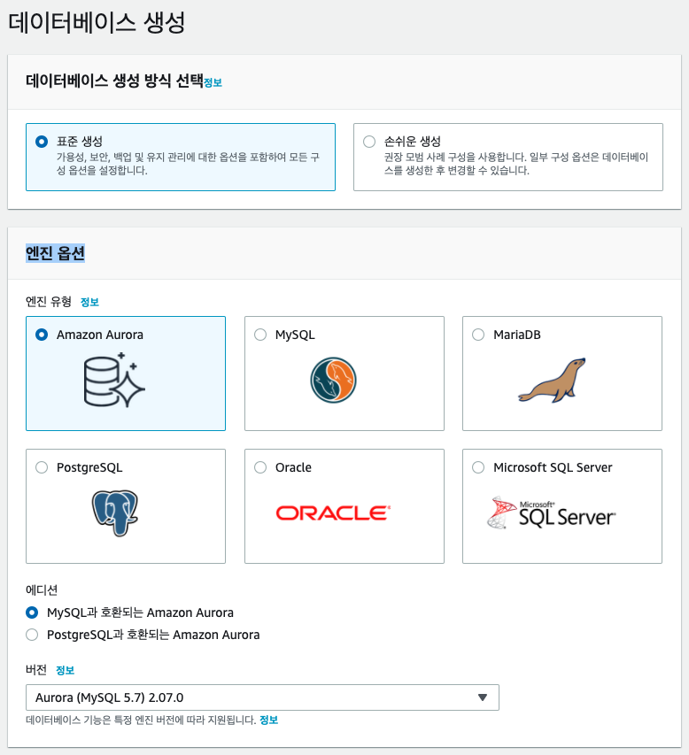

## Aurora DB

> Aurora MySQL 생성 가이드





## EC2 instance 생성

> EC2 instance 생성 가이드

> MySQL Client 설치

> 인스턴스 접속

## MySQL 셋업 및 테이블 생성


데이터 다운로드

```
wget https://raw.githubusercontent.com/elbanic/summit_2020_demo/master/sample-data/users/users.csv
wget https://raw.githubusercontent.com/elbanic/summit_2020_demo/master/sample-data/products/products.csv
```


MySQL Client로 Aurora MySQL 접속

```
mysql -h summit-db-cluster-instance-1.csz1mbf6avao.ap-northeast-2.rds.amazonaws.com -P 3306 -u admin -p
Enter password:
```

DB 유저 생성

```
CREATE USER 'user1'@'%' IDENTIFIED BY 'password1';

GRANT SELECT, INSERT, UPDATE, DELETE, CREATE, DROP, RELOAD, PROCESS, REFERENCES, INDEX, ALTER, SHOW DATABASES, CREATE TEMPORARY TABLES, LOCK TABLES, EXECUTE, REPLICATION SLAVE, REPLICATION CLIENT, CREATE VIEW, SHOW VIEW, CREATE ROUTINE, ALTER ROUTINE, CREATE USER, EVENT, TRIGGER ON *.* TO 'user1'@'%' WITH GRANT OPTION;
```

데이터 

```
mysql -h summit-db-cluster-instance-1.csz1mbf6avao.ap-northeast-2.rds.amazonaws.com -P 3306 -u user1 -p
Enter password:

CREATE TABLE products (
    product_id BIGINT PRIMARY KEY,
    category_id VARCHAR(30),
    category_code VARCHAR(30),
    brand VARCHAR(30),
    price FLOAT,
    product_name VARCHAR(30)
);

LOAD DATA LOCAL INFILE '/home/ec2-user/products.csv' INTO TABLE products
FIELDS TERMINATED BY ','
OPTIONALLY ENCLOSED BY '"'
IGNORE 1 LINES;
```

```


```
s


---
<p align="center">
© 2020 Amazon Web Services, Inc. 또는 자회사, All rights reserved.
</p>
