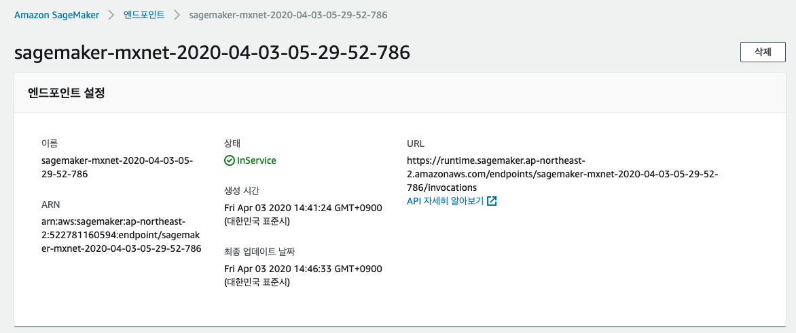

이번 단계에서는 SageMaker를 이용하여 사용자의 구매 이력으로부터 특정 상품과의 연관성을 측정하는 간단한 머신러닝 모델을 만듭니다. 

> Lab은 Aurora에서 ML 모델을 호출하는 과정에 대해서 집중적으로 다루었습니다. 추천 모델링에 사용한 머신 러닝 기법이라던가 자세히 다루지 않고, 또는 그 방법이 적합하지 않을 수 있습니다. 따라서 어떻게 머신 러닝을 하는지가 아니라 어떻게 서비스를 연동하는지에 초점을 맞추시는 것을 추천합니다.

## Table of Contents

1. SageMaker Notebook 생성하기
2. 데이터 Explore / Clean / Prepare
3. 모델 학습하기
4. MySQL 셋업 및 테이블 생성


## SageMaker Notebook 생성하기


[Create a Notebook Instance](https://docs.aws.amazon.com/ko_kr/sagemaker/latest/dg/howitworks-create-ws.html)를 참고하여 노트북 인스턴스를 생성합니다.

1. Amazon SageMaker 콘솔로 이동합니다. [link](https://console.aws.amazon.com/sagemaker/)

2. 노트북 인스턴스를 선택한 후 노트북 인스턴스 생성을 선택합니다.

3. 노트북 인스턴스 생성 페이지에서 `노트북 인스턴스 이름`과 `노트북 인스턴스 유형`을 선택합니다.

```
노트북 인스턴스 이름: sg-notebook-reco
노트북 인스턴스 유형: ml.p2.xlarge
```


4. 권한 및 암호화에서 IAM 역할을 선택합니다. IAM 역할이 없으면 새로 생성합니다.


5. `노트북 인스턴스 생성`을 클릭하여 인스턴스를 생서합니다.

6. 노트북 인스턴스의 상태가 `Pending`에서 `InService`로 바뀌면 `Jupyter 열기`를 클릭하여 노트북에 접속합니다.


## 데이터 Explore / Clean / Prepare

이번 실습에서는 SageMaker에서 제공하는 Example 중 gluon_recommender_system을 참고하여 추천 모델을 만들기 위한 데이터 탐색 / 클리닝 / 전처리 과정을 거칩니다.
앞서 접속한 SageMaker 노트북에서 SageMaker Example 탭을 선택하면 Introduction to Applying Machine Learning의 gluon_recommender_system의 내용과 동일합니다.
실습에서 사용한 SageMaker 노트북은 [Github summit_2020_demo](https://github.com/elbanic/summit_2020_demo/notebooks)에서 다운로드할 수 있습니다.


1. 우측 상단의 New -> conda_mxnet_p36을 선택하여 노트북을 생성합니다. 노트북 이름은 `ecommerce_recommender_system`로 저장합니다.

2. S3 버킷과 Prefix를 지정합니다.

```
bucket = 'summit-2020-db-ml'
prefix = 'sagemaker/DEMO-gluon-recsys'

import sagemaker
role = sagemaker.get_execution_role()
```

3. 필요한 라이브러리를 import 합니다.

```
import os
import mxnet as mx
from mxnet import gluon, nd, ndarray
from mxnet.metric import MSE
import pandas as pd
import numpy as np
import sagemaker
from sagemaker.mxnet import MXNet
import boto3
import json
import matplotlib.pyplot as plt
```

4. 실습 1에서 저장했던 데이터를 다운로드합니다.

```
!mkdir /tmp/recsys/
!aws s3 cp s3://summit-2020-db-ml/ecommerce-behavior-data/org/2019-Oct.csv /tmp/recsys/
!aws s3 cp s3://summit-2020-db-ml/ecommerce-behavior-data/org/2019-Nov.csv /tmp/recsys/
```

5. 데이터를 Pandas Dataframe으로 변환합니다. 두 개의 파일을 읽어서 dataframe으로 합칩니다.

```
df_Oct = pd.read_csv('/tmp/recsys/2019-Oct.csv', delimiter=',',error_bad_lines=False)
df_Nov = pd.read_csv('/tmp/recsys/2019-Nov.csv', delimiter=',',error_bad_lines=False)
df = pd.concat([df_Oct,df_Nov], ignore_index=True)
df.head()
```

6. 학습에 필요한 컬럼만 가져옵니다. 'category_id', 'category_code', 'brand'는 학습에 사용되지는 않지만 후애 모델 검증에 사용됩니다.
'view, cart, remove_from_cart, purchase' 네 가지 타입은 학습에 사용될 주요 피쳐이기 때문에 디지털화합니다.

```
df = df[['user_id', 'product_id', 'event_type', 'category_id', 'category_code', 'brand']]
df['event_type_digit'] = df['event_type'].apply(lambda x: 4 if x=='purchase' else 3 if x=='cart' else 2 if x=='remove_from_cart' else 1)
```

7. 데이터가 어떻게 분포하는지 확인합니다.

```
users = df['user_id'].value_counts()
products = df['product_id'].value_counts()

quantiles = [0, 0.01, 0.02, 0.03, 0.04, 0.05, 0.1, 0.25, 0.5, 0.75, 0.9, 0.95, 0.96, 0.97, 0.98, 0.99, 1]
print('users\n', users.quantile(quantiles))
print('products\n', products.quantile(quantiles))
```

8. 너무 낮은 빈도의 데이터는 머신 러닝 학습에는 불필요한 노이즈가 될 수 있습니다.
5개 이상 트랜잭션이 있었던 user와 product만 남깁니다.

```
users = users[users >= 5]
products = products[products >= 5]

reduced_df = df.merge(pd.DataFrame({'user_id': users.index})).merge(pd.DataFrame({'product_id': products.index}))
```

9. Test용 데이터셋과 Train용 데이터셋을 나눕니다.


```
test_df = reduced_df.groupby('user_id').last().reset_index()

train_df = reduced_df.merge(test_df[['user_id', 'product_id']], 
                            on=['user_id', 'product_id'], 
                            how='outer', 
                            indicator=True)
train_df = train_df[(train_df['_merge'] == 'left_only')]
```

10. 각 데이터셋과 batch 사이즈를 설정합니다.

```
batch_size = 1024

train = gluon.data.ArrayDataset(nd.array(train_df['user'].values, dtype=np.float32),
                                nd.array(train_df['item'].values, dtype=np.float32),
                                nd.array(train_df['event_type_digit'].values, dtype=np.float32))
test  = gluon.data.ArrayDataset(nd.array(test_df['user'].values, dtype=np.float32),
                                nd.array(test_df['item'].values, dtype=np.float32),
                                nd.array(test_df['event_type_digit'].values, dtype=np.float32))

train_iter = gluon.data.DataLoader(train, shuffle=True, num_workers=4, batch_size=batch_size, last_batch='rollover')
test_iter = gluon.data.DataLoader(train, shuffle=True, num_workers=4, batch_size=batch_size, last_batch='rollover')
```


## 모델 학습하기

### Train Locally

1. Network를 정의합니다

```
class MFBlock(gluon.HybridBlock):
    def __init__(self, max_users, max_items, num_emb, dropout_p=0.5):
        super(MFBlock, self).__init__()
        
        self.max_users = max_users
        self.max_items = max_items
        self.dropout_p = dropout_p
        self.num_emb = num_emb
        
        with self.name_scope():
            self.user_embeddings = gluon.nn.Embedding(max_users, num_emb)
            self.item_embeddings = gluon.nn.Embedding(max_items, num_emb)
            
            self.dropout_user = gluon.nn.Dropout(dropout_p)
            self.dropout_item = gluon.nn.Dropout(dropout_p)

            self.dense_user   = gluon.nn.Dense(num_emb, activation='relu')
            self.dense_item = gluon.nn.Dense(num_emb, activation='relu')
            
    def hybrid_forward(self, F, users, items):
        a = self.user_embeddings(users)
        a = self.dense_user(a)
        
        b = self.item_embeddings(items)
        b = self.dense_item(b)

        predictions = self.dropout_user(a) * self.dropout_item(b)     
        predictions = F.sum(predictions, axis=1)
        return predictions

num_embeddings = 64

net = MFBlock(max_users=user_index.shape[0], 
              max_items=product_index.shape[0],
              num_emb=num_embeddings,
              dropout_p=0.5)
```

2. 파라미터를 설정합니다.

```
# Initialize network parameters
ctx = mx.gpu()
net.collect_params().initialize(mx.init.Xavier(magnitude=60),
                                ctx=ctx,
                                force_reinit=True)
net.hybridize()

# Set optimization parameters
opt = 'sgd'
lr = 0.02
momentum = 0.9
wd = 0.

trainer = gluon.Trainer(net.collect_params(),
                        opt,
                        {'learning_rate': lr,
                         'wd': wd,
                         'momentum': momentum})
```

3. 실행하는 함수를 작성합니다

```
def execute(train_iter, test_iter, net, epochs, ctx):
    
    loss_function = gluon.loss.L2Loss()
    for e in range(epochs):
        
        print("epoch: {}".format(e))
        
        for i, (user, item, label) in enumerate(train_iter):
                user = user.as_in_context(ctx)
                item = item.as_in_context(ctx)
                label = label.as_in_context(ctx)
                
                with mx.autograd.record():
                    output = net(user, item)               
                    loss = loss_function(output, label)
                    
                loss.backward()
                trainer.step(batch_size)

        print("EPOCH {}: MSE ON TRAINING and TEST: {}. {}".format(e,
                                                                   eval_net(train_iter, net, ctx, loss_function),
                                                                   eval_net(test_iter, net, ctx, loss_function)))
    print("end of training")
    return net

def eval_net(data, net, ctx, loss_function):
    acc = MSE()
    for i, (user, item, label) in enumerate(data):
        
            user = user.as_in_context(ctx)
            item = item.as_in_context(ctx)
            label = label.as_in_context(ctx)
            predictions = net(user, item).reshape((batch_size, 1))
            acc.update(preds=[predictions], labels=[label])
   
    return acc.get()[1]
```

4. 생성한 함수들을 local에서 테스트합니다

```
%%time

epochs = 3

trained_net = execute(train_iter, test_iter, net, epochs, ctx)
```

5. 모델 훈련이 완료되면 아래와 같이 사전 검증을 시도할 수 있습니다.

```
product_index['u6_predictions'] = trained_net(nd.array([6] * product_index.shape[0]).as_in_context(ctx), 
                                              nd.array(product_index['item'].values).as_in_context(ctx)).asnumpy()
product_index.sort_values('u6_predictions', ascending=False)
```

```
product_index['u7_predictions'] = trained_net(nd.array([7] * product_index.shape[0]).as_in_context(ctx), 
                                              nd.array(product_index['item'].values).as_in_context(ctx)).asnumpy()
product_index.sort_values('u7_predictions', ascending=False)
```

```
product_index[['u6_predictions', 'u7_predictions']].plot.scatter('u6_predictions', 'u7_predictions')
plt.show()
```

### Train with SageMaker

1. Local이 아닌 API를 이용하여 SageMaker에서 학습할 수 있습니다. 이렇게 하면 훈련 작업을 시켜놓고 다른 작업을 할 수 있어 생산성이 향상됩니다.
SageMaker의 Built-in MXNet 컨테이너를 사용하기 위해서는 위 함수를 Python 스크립트로 작성해야 합니다. [recommender.py](https://github.com/elbanic/summit_2020_demo/blob/master/sagemaker-notebook/recommender.py)를 참조해 주시기 바랍니다.

2. SageMaker는 S3의 데이터를 다운로드하여 학습할 수 있습니다. 실습에서 사용한 파일을 하나로 합쳐서 training용 경로에 업로드합니다.

```
!cat /tmp/recsys/2019-Oct.csv > /tmp/recsys/2019-Oct-Nov.csv
!tail -n +2 /tmp/recsys/2019-Nov.csv >> /tmp/recsys/2019-Oct-Nov.csv
boto3.client('s3').upload_file('/tmp/recsys/2019-Oct-Nov.csv', bucket, prefix + '/train/2019-Oct-Nov.csv')
```

3. recommender.py

```

opt = 'sgd'
lr = 0.02
momentum = 0.9
wd = 0.

m = MXNet('recommender.py', 
          py_version='py3',
          role=role, 
          train_instance_count=1, 
          train_instance_type="ml.p3.2xlarge",
          output_path='s3://{}/{}/output'.format('summit-2020-db-ml', 'ecommerce-behavior-data'),
          hyperparameters={'num_embeddings': 64, 
                           'opt': opt, 
                           'lr': lr, 
                           'momentum': momentum, 
                           'wd': wd,
                           'epochs': 10},
         framework_version='1.1')

m.fit({'train': 's3://{}/{}/train/'.format('summit-2020-db-ml', 'ecommerce-behavior-data')})
```


## Endpoint 생성하기

1. 학습이 완료된 모델을 배포합니다. 배포가 완료되면 이 모델의 추론 가능한 엔드포인트가 생성됩니다.

```
predictor = m.deploy(initial_instance_count=1, 
                     instance_type='ml.m4.xlarge')
predictor.serializer = None
```

2. Endpoint를 생성하면 [SageMaker 콘솔 Endpoint](https://ap-northeast-2.console.aws.amazon.com/sagemaker/home?region=ap-northeast-2#/endpoints)에서 상세 정보를 확인할 수 있습니다.


3. 추론 엔트포인트를 호출하기 위해서는 predict를 이용해서 호출할 수 있습니다.

```
predictor.predict(json.dumps({'user_id': user_index[user_index['user'] == 6]['user_id'].values.tolist(), 
                              'product_id': [44600062, 1307067]}))
```

4. [SageMaker Endpoint](https://ap-northeast-2.console.aws.amazon.com/sagemaker/home?region=ap-northeast-2#/endpoints)에 접속하여 위에서 생성한 엔드포인트를 확인하고 엔드포인트 이름을 따로 기록해 둡니다.



실습에서 사용한 SageMaker 노트북은 [Github summit_2020_demo](https://github.com/elbanic/summit_2020_demo/tree/master/sagemaker-notebook)에서 다운로드할 수 있습니다.


---
<p align="center">
© 2020 Amazon Web Services, Inc. 또는 자회사, All rights reserved.
</p>
