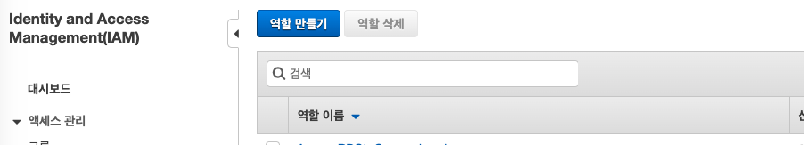
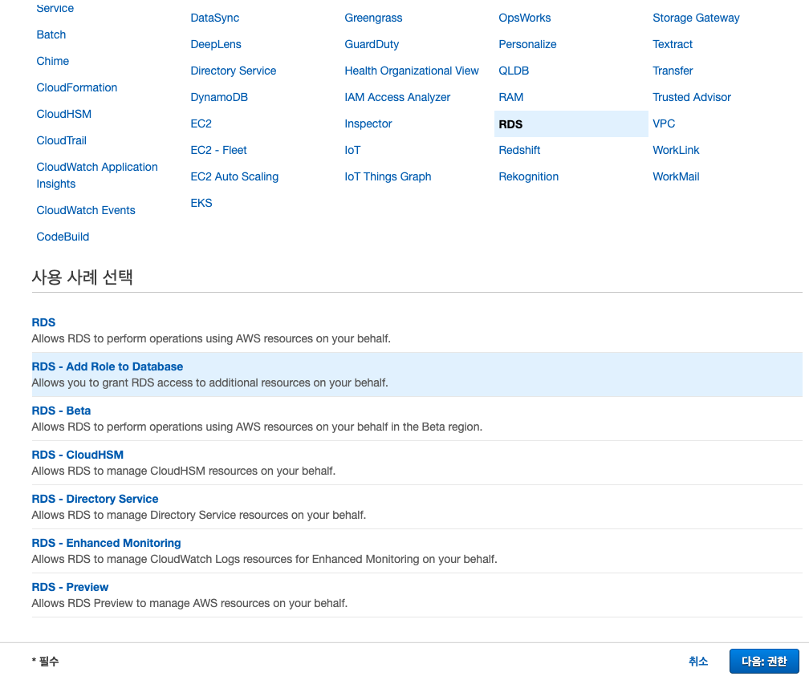
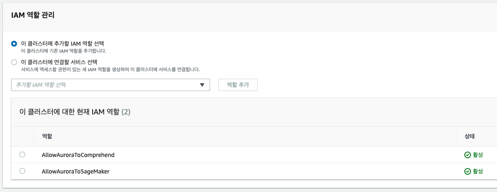
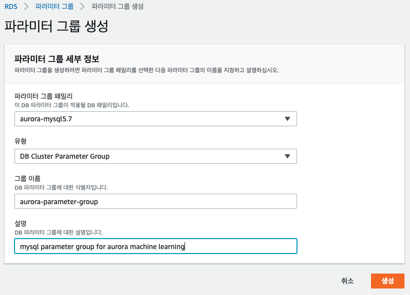

이번 단계에서는 Aurora에서 SQL을 이용하여 SageMaker의 모델을 사용하는 실습입니다.

이 페이지는 [Aurora MySQL에서 기계 학습(ML) 사용](https://docs.aws.amazon.com/ko_kr/AmazonRDS/latest/AuroraUserGuide/mysql-ml.html)을 참고하여 작성되었습니다.

## Table of Contents

1. Aurora 기계 학습의 사전 조건
2. Amazon RDS에서 Amazon SageMaker와 Amazon Comprehend에 대한 IAM 액세스 권한 설정
3. Amazon SageMaker를 사용하여 자체 ML 모델 실행


## Aurora 기계 학습의 사전 조건

현재 Aurora 기계 학습에서는 클러스터가 Aurora MySQL 데이터베이스 엔진을 사용할 것을 요구합니다. 이 기능은 Aurora MySQL 2.07.0 이상을 실행하는 모든 Aurora 클러스터에서 사용할 수 있습니다. 이전 Aurora 클러스터를 이러한 릴리스 중 하나로 업그레이드하고 이 클러스터에서 이 기능을 사용할 수 있습니다.

[Aurora 기계 학습의 사전 조건](https://docs.aws.amazon.com/ko_kr/AmazonRDS/latest/AuroraUserGuide/mysql-ml.html#aurora-ml-prereqs)


## Amazon RDS에서 Amazon SageMaker와 Amazon Comprehend에 대한 IAM 액세스 권한 설정

### Aurora에서 Amazon Comprehend와 Amazon SageMaker 접근 가능하도록 IAM 역할 생성하기

1. [IAM 콘솔](https://console.aws.amazon.com/iam/home?region=ap-northeast-2#/roles)로 이동합니다. 
좌측 네비게이션 바에서 역할을 선택하고 역할 만들기를 선택합니다.



2. 신뢰할 수 있는 유형의 개체 선택에서 AWS 서비스를 선택하고, RDS -> RDS - Add Role to Database를 선택합니다.



3. ComprehendFullAccess 정책을 선택합니다.


4. AllowAuroraToComprehend 이름으로 역할 생성합니다.


5. 1 - 4 과정을 다시 반복하여 AmazonSageMakerFullAccess 정책을 포함하는 AllowAuroraToSageMaker 명명한 역할을 동일하게 생성합니다.


### Amazon RDS에 IAM 역할 지정

1. [RDS 콘솔](https://ap-northeast-2.console.aws.amazon.com/rds/home?region=ap-northeast-2#databases:)의 Aurora 클러스터로 이동합니다.
2. 연결 & 보안 탭에서 스크롤하여 IAM 역할 관리 패널로 이동합니다.
3. 이 클러스터에 추가할 IAM 역할 선택에서 AllowAuroraToComprehend 과 AllowAuroraToSageMaker를 선택하여 각각 역할을 추가합니다.



### 파라미터 그룹에 추가

1. [RDS 콘솔](https://ap-northeast-2.console.aws.amazon.com/rds/home?region=ap-northeast-2#parameter-groups:)의 파라미터 그룹으로 이동합니다.
2. 파라미터 그룹 생성을 클릭합니다.


3. 아래 값을 참고하여 파라미터 그룹을 생성합니다.

```
유형: DB Cluster Parameter Group
이름: aurora-parameter-group
설명: mysql parameter group for aurora machine learning
```



4. 파라미터 그룹을 클릭하여 세부사항을 수정합니다.

5. comprehend를 필터링하여 파라미터 편집을 클릭하고 `값`에 Comprehend 권한을 가진 IAM 롤의 ARN을 붙여넣기 합니다.


**IAM 역할의 ARN은 IAM 역할에 접속하여 확인할 수 있습니다.**


6. 동일한 방식으로 SageMaker의 파라미터에도 적용합니다.


7. 변경사항 저장을 클릭하여 파라미터 그룹 편집을 완료합니다.


8. 이제 Aurora 클러스터에 파라미터 그룹이 적용되도록 수정해야 합니다.
데이터 베이스 클러스터를 선택하고 수정 버튼을 누릅니다.


9. 데이터베이스 옵션에서 DB 클러스터 파라미터 그룹을 앞의 스텝에서 생성한 aurora-parameter-group으로 선택합니다.


10. 수정 사항을 즉시 적용하여 반영합니다.


11. 데이터베이스를 재부팅하여 적용된 파라미터를 오로라에서 사용 가능하게 합니다.


### Aurora 기계 학습 서비스 호출을 위한 SQL 권한 부여

데모에서는 admin 유저를 사용하고 있습니다. 만약 데이터베이스 유저에게 Aurora 기계 학습 서비스 호출 권한이 없다면 아래와 같이 추가해 줍니다.

```
GRANT INVOKE SAGEMAKER ON *.* TO 'user1'@'%' WITH GRANT OPTION;
```

### Aurora MySQL에서 다른 AWS 서비스로의 네트워크 통신 활성화

MySQL이 네트워크 통신이 가능하도록 설정해야 합니다. 우리는 Lab에서 Aurora 클러스터를 생성할 때에 public access를 허용하도록 지정했습니다.
이는 Lab에서 SageMaker와 Comprehend에 대한 네트워크 통신을 용이하게 하기 위한 것으로, Production 환경에서는 클러스터를 private network에 두고 Nat gateway를 이용하는 것을 권장합니다.

[Amazon Aurora MySQL에서 다른 AWS 서비스로의 네트워크 통신 활성화](https://docs.aws.amazon.com/ko_kr/AmazonRDS/latest/AuroraUserGuide/AuroraMySQL.Integrating.Authorizing.Network.html)


## Amazon SageMaker를 사용하여 자체 ML 모델 실행

> Lab은 Aurora에서 ML 모델을 호출하는 과정에 대해서 집중적으로 다루었습니다. 추천 모델링에 사용한 머신 러닝 기법이라던가 자세히 다루지 않고, 또는 그 방법이 적합하지 않을 수 있습니다. 따라서 어떻게 머신 러닝을 하는지가 아니라 어떻게 서비스를 연동하는지에 초점을 맞추시는 것을 추천합니다.

1. Aurora MySQL에 접속합니다.

```
mysql -h summit-db-cluster-instance-1.csz1mbf6avao.ap-northeast-2.rds.amazonaws.com -P 3306 -u admin -p
Enter password:
```

2. Lab 2의 SageMaker Notebook으로 Training했던 Model의 Endpoint를 이용하여 MySQL Function을 만듭니다.

```
CREATE FUNCTION recommend_score (
       user_id BIGINT(20),
       product_id BIGINT(20))
RETURNS double
       alias aws_sagemaker_invoke_endpoint
       endpoint name 'sagemaker-mxnet-2020-04-03-05-29-52-786';
```

3. Endpoint name은 [SageMaker Endpoint](https://ap-northeast-2.console.aws.amazon.com/sagemaker/home?region=ap-northeast-2#/endpoints)에서 확인할 수 있습니다.


4. 샘플을 만들어서 테스트해 봅니다. User 512505687와 상품 44600062의 모델 추론 결과값을 얻습니다.

```
CREATE TABLE input (
    user_id varchar(20) PRIMARY KEY,
    product_id varchar(20)
);

INSERT INTO input
VALUES (512505687,44600062);


SELECT *, recommend_score(user_id,product_id) recommend_score FROM input;
```


5. users와 products 테이블은 아직 연관성이 없습니다.
따라서 모든 유저에게 모든 상품 중에 어떤 상품이 가장 점수가 높은지를 봐야합니다.
예를 들면 아래와 같이 유저별로 각 상품의 추론 결과를 받아오는 것입니다.

```
A 유저 - 1 상품
A 유저 - 2 상품
A 유저 - 3 상품
B 유저 - 1 상품
B 유저 - 2 상품
B 유저 - 3 상품
```

6. 유저별 각 상품의 점수를 부여하기 위한 SQL문을 작성합니다.

```
CREATE TABLE IF NOT EXISTS inputs
    SELECT U.user_id, P.product_id
    FROM users AS U
    CROSS JOIN products AS P limit 100000;
```

7. CTAS를 이용하여 추론 결과를 새로운 테이블로 만들어 봅니다.

```
CREATE TABLE IF NOT EXISTS predict
    SELECT *, recommend_score(user_id,product_id) recommend_score FROM inputs;

SELECT * FROM predict limit 10;
```


---
<p align="center">
© 2020 Amazon Web Services, Inc. 또는 자회사, All rights reserved.
</p>


