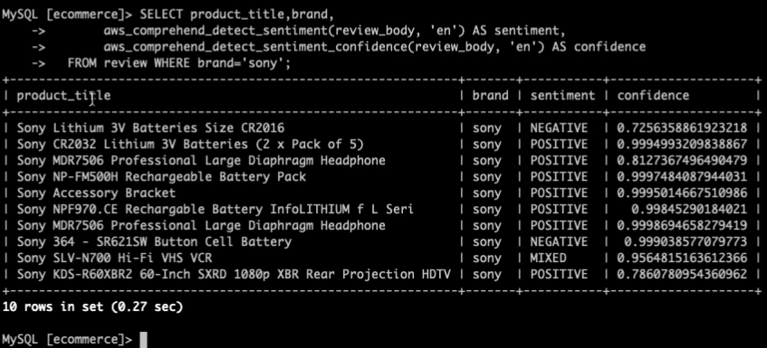

이번 단계에서는 Aurora MySQL에서 Comprehend Sentiment 분석 API를 호출합니다.

## Table of Contents

1. 실습 데이터 다운로드 (Amazon Review dataset)
2. Comprehend API 호출하는 SQL function 만들기
3. 분석 결과 활용

## 실습 데이터 다운로드 (Amazon Review dataset) 

1. Sentiment 분석 대상이 되는 데이터를 다운로드합니다.
저희는 Ecommerce와 연관성이 높은 상품 위주로 Amazon Review 데이터의 일부를 미리 뽑아 두었습니다.
Amazon Review 데이터에 대한 자세한 사항은 이 [링크](https://s3.amazonaws.com/amazon-reviews-pds/readme.html)를 통해 확인해 주시기 바랍니다.

```
wget https://raw.githubusercontent.com/elbanic/summit_2020_demo/master/sample-data/mart-final.txt
```

2. RDS에 접속합니다.

```
mysql -h summit-db-cluster-instance-1.csz1mbf6avao.ap-northeast-2.rds.amazonaws.com -P 3306 -u admin -p
Enter password:
```

3. 다운받은 파일을 이용하여 데이터베이스 테이블을 만듭니다.

```
USE ecommerce;

create table review (
  product_title varchar(100),
  review_body longtext,
  brand varchar(30) 
)

LOAD DATA LOCAL INFILE '/home/ec2-user/mart-final.txt' INTO TABLE review
FIELDS TERMINATED BY '|';
```

## Comprehend API 호출하는 SQL function 만들기

1. Aurora MySQL에는 Sentiment 분석 API를 호출하는 함수는 이미 정의되어 있습니다.
[aws_comprehend_detect_sentiment, aws_comprehend_detect_sentiment_confidence](https://docs.aws.amazon.com/AmazonRDS/latest/AuroraUserGuide/mysql-ml.html#using-amazon-comprehend-for-sentiment-detection) 함수를 이용하여 SQL문을 작성할 수 있습니다.
아래 예제에서는 'sony'를 브랜드명 필터로 확인하고 있습니다.

```
SELECT product_title,brand,
       aws_comprehend_detect_sentiment(review_body, 'en') AS sentiment,
       aws_comprehend_detect_sentiment_confidence(review_body, 'en') AS confidence
  FROM review WHERE brand='sony';
```

2. 결과물을 보면 `sentiment` 결과와 `confidence` 값을 받아온 것을 확인할 수 있습니다.




## 분석 결과 활용

**지금까지 우리는 1. 유저별 상품의 연관성 점수와 2. 브랜드별 Sentiment 점수를 얻었습니다.**

**이를 활용하면 Sentiment 분석 결과가 좋은 브랜드를 위주로 recommend_score가 높은 순으로 내림차순 정렬하면 유저별 추천 상품을 얻을 수 있을 것입니다.**

**여러분의 아이디어를 SQL을 이용하여 쉽고 빠르게 적용하시기 바랍니다!**


---
<p align="center">
© 2020 Amazon Web Services, Inc. 또는 자회사, All rights reserved.
</p>


